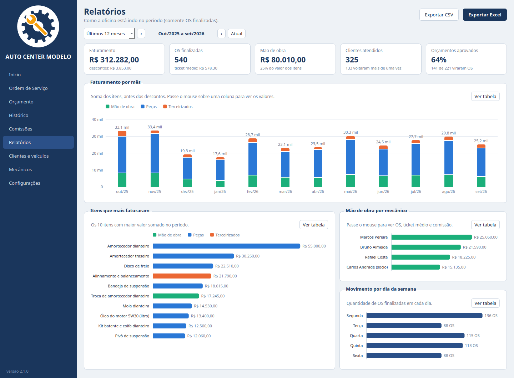
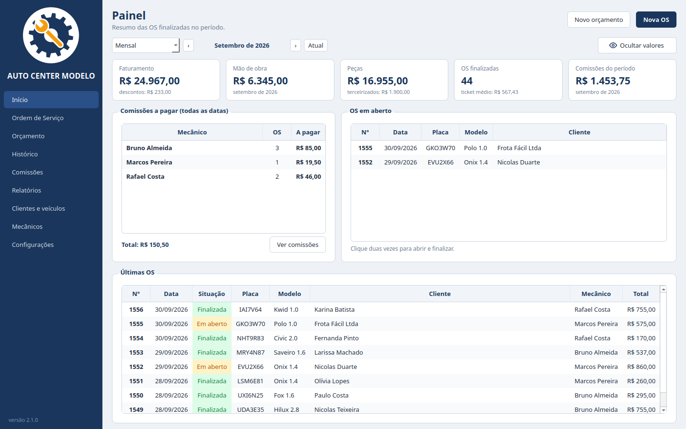
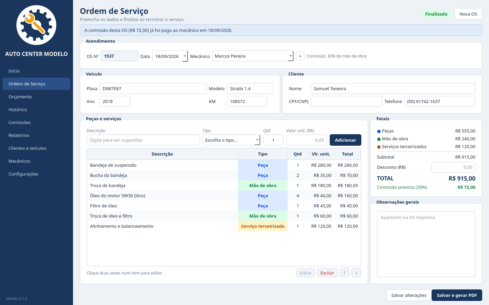
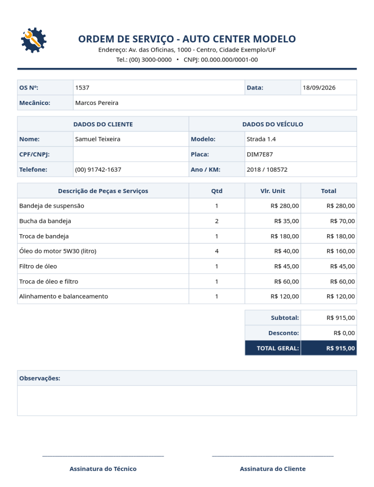
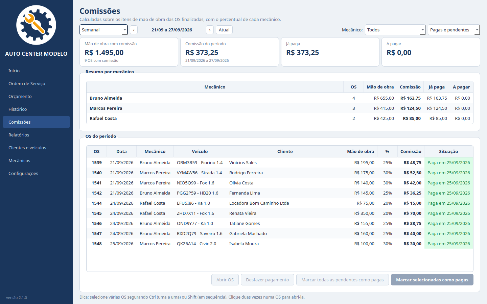
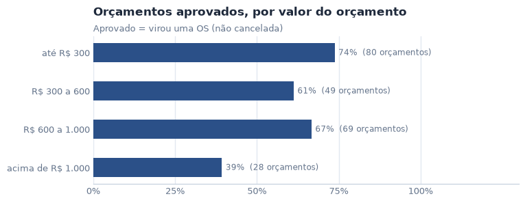
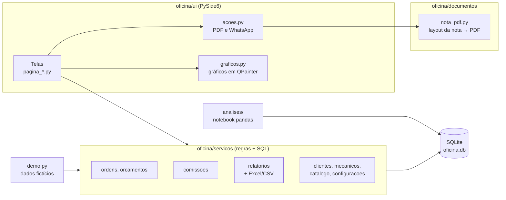

# Sistema de Oficina

[](https://github.com/DeQueirozRaul/Sistema_de_Oficina/actions/workflows/testes.yml)

-41CD52?logo=qt&logoColor=white)


[](LICENSE)

Sistema desktop para oficinas mecânicas: **ordens de serviço, orçamentos, comissão dos mecânicos,
relatórios gerenciais**, PDF da nota e envio pelo **WhatsApp**. Funciona offline, num único computador,
sem mensalidade.

Ele nasceu para resolver o dia a dia de uma oficina de suspensão de verdade e virou um sistema genérico,
que qualquer oficina pode usar com o próprio nome, logo e mecânicos. Os dados deste repositório e das
imagens abaixo são **fictícios**, gerados pelo modo de demonstração.



## Sumário

- [O problema](#o-problema)
- [O que o sistema faz](#o-que-o-sistema-faz)
- [Regras da comissão](#regras-da-comissão)
- [Análise de dados](#análise-de-dados)
- [Como experimentar](#como-experimentar)
- [Arquitetura](#arquitetura)
- [Decisões técnicas](#decisões-técnicas)
- [Testes e qualidade](#testes-e-qualidade)
- [Instalar numa oficina](#instalar-numa-oficina)
- [Próximos passos](#próximos-passos)

## O problema

A primeira versão era um programa em Tkinter que só gerava a OS: preenchia uma planilha e o Excel a convertia
em PDF. Não havia banco de dados, então a comissão dos mecânicos ficava fora do sistema e perguntas simples
não tinham resposta rápida: quanto entrou de mão de obra este mês? Qual mecânico já recebeu? Quantos
orçamentos viraram serviço?

Esta versão foi reescrita em PySide6, com SQLite, e passou a cuidar da gestão da oficina:

- a OS e o orçamento saem em PDF no **mesmo layout** que a oficina já usava (e que os clientes já conheciam);
- a **comissão** é calculada sozinha, só sobre a mão de obra, e cada OS fica marcada como paga ou pendente;
- o **painel** e os **relatórios** mostram faturamento, mão de obra, peças e comissões de qualquer período;
- o PDF vai para o **WhatsApp** do cliente com dois cliques, sem API paga.

## O que o sistema faz

| Tela | Para quê |
|---|---|
| **Início** | Faturamento, mão de obra, peças e comissões do mês (ou semana/período), OS em aberto e comissões a pagar. Os valores em R$ abrem **escondidos** (como nos apps de banco) e aparecem no botão do "olho". |
| **Ordem de Serviço** | Digitando a placa, os dados do carro e do cliente são preenchidos sozinhos. Cada item tem um tipo (peça, mão de obra ou serviço terceirizado) e o autocompletar sugere o último valor usado. |
| **Orçamento** | Quando o cliente aprova, vira OS com um clique. |
| **Histórico** | Busca por número, placa, cliente, modelo ou mecânico; reimprime PDF; cancela/reativa OS. |
| **Comissões** | Filtro semanal, mensal ou por período, por mecânico; marca a comissão de cada OS como paga. |
| **Relatórios** | Faturamento por dia/semana/mês dividido por tipo, itens que mais faturaram, mão de obra por mecânico, movimento por dia da semana, clientes que voltaram e taxa de aprovação dos orçamentos. Exporta para **Excel** e **CSV**. |
| **Clientes e veículos** | Corrige ou completa os cadastros (criados automaticamente ao salvar uma OS). |
| **Mecânicos** | Cadastro com o percentual de comissão de cada um. |
| **Configurações** | Nome, endereço, telefone, CNPJ e **logo** da oficina, numeração, pastas dos PDFs, WhatsApp e backup. |

<table>
  <tr>
    <td width="50%"></td>
    <td width="50%"></td>
  </tr>
  <tr>
    <td><b>Início:</b> o resumo do mês e o que está pendente.</td>
    <td><b>Ordem de Serviço:</b> itens por tipo; a comissão prevista aparece nos totais.</td>
  </tr>
  <tr>
    <td></td>
    <td></td>
  </tr>
  <tr>
    <td><b>PDF da OS:</b> com a logo e os dados da oficina.</td>
    <td><b>Comissões:</b> quanto cada mecânico tem a receber e o que já foi pago.</td>
  </tr>
</table>

**Enviar pelo WhatsApp.** O botão copia o PDF para a área de transferência e abre a conversa (no aplicativo do
WhatsApp ou no WhatsApp Web): é só apertar `Ctrl+V` e `Enter`. Vai para o celular do cliente informado na OS ou,
se preferir (ou se não houver celular), para o número da própria oficina. Não usa API nem automação, então não
tem custo nem risco de bloqueio do número.

## Regras da comissão

A regra de negócio mais importante do sistema, e a que mais tem testes:

- Só itens do tipo **mão de obra** geram comissão. Peças e serviços terceirizados (retífica, alinhamento feito
  fora...) não entram. O tipo é obrigatório em todo item, para não gerar comissão errada sem perceber.
- Comissão = total da mão de obra × percentual do mecânico. O **desconto** dado ao cliente não reduz a comissão.
- Só contam **OS finalizadas**, pela data da OS; em aberto e canceladas ficam de fora.
- O percentual é **gravado na OS quando ela é finalizada**: se o percentual do mecânico mudar depois, as OS
  antigas continuam com o valor da época.
- Um mecânico com **0%** (por exemplo, um sócio) não gera comissão a pagar, mas a mão de obra dele continua no
  faturamento.
- Se a comissão de uma OS já foi paga e alguém tenta alterar um valor que mudaria a comissão, o sistema avisa antes.

## Análise de dados

O notebook [`analises/analise_oficina.ipynb`](analises/analise_oficina.ipynb) usa **pandas** e **matplotlib**
sobre as mesmas tabelas do sistema para responder perguntas de negócio de uma oficina:

| Pergunta | Técnica |
|---|---|
| Como o faturamento evoluiu e do que ele é feito? | Série mensal com `resample`, composição por tipo, correlação entre volume e faturamento |
| Há meses e dias da semana mais fortes? | Média de OS **por dia útil** de cada tipo (a contagem bruta engana: um período pode ter mais segundas que sextas) |
| Quais itens trazem o dinheiro? | Curva ABC (Pareto) com descrições normalizadas |
| Como cada mecânico contribui? | Volume × mão de obra por OS × comissão efetiva |
| Os clientes voltam? | Distribuição de visitas, participação dos recorrentes no faturamento, intervalo entre visitas |
| O que pesa na aprovação de um orçamento? | Conversão por faixa de valor e **teste de permutação** para ver se a diferença é acaso |

<p align="center">
  
</p>

Exemplo de conclusão: orçamentos acima de R$ 1.000 são aprovados bem menos (39% contra 68%, p ≈ 0,003), então
vale um retorno ativo e uma proposta de parcelamento para eles. Os gráficos seguem as mesmas cores da tela de
Relatórios, e todas as saídas do notebook ficam salvas, então dá para ler direto no GitHub.

## Como experimentar

Precisa do **Python 3.11 ou mais novo**. Funciona no Windows e no Linux.

```bash
git clone https://github.com/DeQueirozRaul/Sistema_de_Oficina.git
cd Sistema_de_Oficina
python -m venv .venv
.venv\Scripts\activate            # Linux/macOS: source .venv/bin/activate
pip install -r requirements.txt
python main.py --demo             # abre com uma oficina fictícia com 12 meses de movimento
```

O modo `--demo` cria o banco em `dados_demo/`, sem tocar em dados reais. Sem `--demo`, o sistema abre vazio e
pergunta o nome da oficina e a numeração inicial das OS.

Para o notebook:

```bash
pip install -r requirements-analise.txt
jupyter lab analises/analise_oficina.ipynb
```

> No Windows, use o Python do **python.org**. O da Microsoft Store costuma dar erro de "Long Path" ao instalar o
> PySide6.

## Arquitetura

O código é separado em camadas. As regras de negócio e o SQL não dependem da interface: são testadas sem abrir
janelas e reaproveitadas pelo notebook e pelo gerador de dados de demonstração.



```
main.py                     ← ponto de entrada (--demo, --verificar)
oficina/
├── modelos.py              ← dataclasses (OS, Item, Mecânico...) e cálculo de totais e comissão
├── dinheiro.py             ← valores em centavos, conversão e formatação em R$
├── banco.py                ← conexão SQLite e migrações (PRAGMA user_version)
├── demo.py                 ← gera a oficina de demonstração
├── servicos/               ← regras de negócio + SQL, sem interface gráfica
├── documentos/             ← montagem e desenho do PDF da OS e do orçamento
└── ui/                     ← telas PySide6 (uma por arquivo), tema, gráficos e logo
analises/                   ← notebook de análise e estilo dos gráficos
ferramentas/                ← geração do ícone e das capturas de tela do README
tests/                      ← pytest: regras, banco, PDF, relatórios, gráficos e fluxo da interface
```

## Decisões técnicas

- **Dinheiro em centavos (`int`), nunca `float`.** Somas de comissão de centenas de OS não podem ter diferença
  de centavos (`0.1 + 0.2 != 0.3` no float). A conversão para reais só acontece na tela, no PDF e na exportação.
- **A OS guarda uma cópia** dos dados do cliente, do veículo, do mecânico e do percentual de comissão. Uma OS
  antiga reimpressa sai igual à original, mesmo que o cadastro tenha mudado.
- **Migrações versionadas** com `PRAGMA user_version`: o banco de quem já usa o sistema é atualizado sozinho, sem
  perder dados, quando sai uma versão nova.
- **PDF desenhado com o próprio Qt (`QPdfWriter`).** A primeira versão gerava uma planilha e convertia para PDF
  pelo Excel (`pywin32`). Agora o layout é reproduzido em `QPainter`, com as mesmas proporções de colunas e
  alturas de linha. Não precisa de Office, roda no Linux, é muito mais rápido e pode ser testado
  automaticamente (os testes conferem cores e posições em pixels da página).
- **Gráficos em `QPainter`, sem matplotlib no programa.** O executável fica menor e os gráficos seguem regras de
  acessibilidade: barras finas, legenda sempre que há mais de uma série, dica ao passar o mouse e o botão "Ver
  tabela" com os mesmos números. As cores dos tipos de item foram validadas para os três tipos de daltonismo.
- **Tarefas demoradas em segundo plano** (`QThreadPool`): gerar o PDF não trava a tela.
- **Tema claro fixo.** Com o Windows em modo escuro, partes que o QSS não cobre (calendário, diálogos) herdavam o
  fundo escuro e o texto ficava invisível; o sistema aplica uma paleta clara própria.
- **Uma instância por computador** (`QLockFile`) e **backup automático diário** do banco (as últimas 60 cópias),
  numa pasta que pode apontar para o Google Drive ou OneDrive.
- **Dados de demonstração reproduzíveis.** `oficina/demo.py` usa uma semente fixa e padrões de uma oficina real:
  sazonalidade, mais movimento na segunda, clientes recorrentes e frotas, orçamentos caros recusados com mais
  frequência e mecânicos com ritmos diferentes. Os telefones usam o DDD 00, que não existe, para o botão do
  WhatsApp nunca chegar a uma pessoa de verdade.

## Testes e qualidade

```bash
pip install -r requirements-dev.txt
python -m pytest                  # regras, banco, PDF, relatórios, gráficos e interface (sem abrir janelas)
ruff check .                      # lint
python main.py --verificar        # autoteste: passa por todas as telas, gera um PDF e um Excel
```

São mais de 100 testes, incluindo fluxos completos da interface (criar uma OS, finalizar, gerar o PDF em segundo
plano, enviar pelo WhatsApp) com o Qt em modo `offscreen`.

O **GitHub Actions** roda o lint e os testes no Ubuntu e no Windows, com Python 3.11 e 3.13, e executa o notebook
de análise. A cada versão publicada (tag `v*`), outro workflow gera o `.exe` com PyInstaller, roda o autoteste
**no próprio executável** e anexa o `.zip` na página de [Releases](https://github.com/DeQueirozRaul/Sistema_de_Oficina/releases).

## Instalar numa oficina

O computador da oficina não precisa de Python:

1. Baixe o `.zip` mais recente em [Releases](https://github.com/DeQueirozRaul/Sistema_de_Oficina/releases)
   (ou gere o programa com `gerar_exe.bat`, que cria um ambiente virtual, roda os testes e chama o PyInstaller).
2. Descompacte a pasta `SistemaOficina` (por exemplo em `C:\SistemaOficina`) e crie um atalho para
   `SistemaOficina.exe` na área de trabalho.

Os dados ficam separados do programa, em `Documentos\Sistema Oficina`, então atualizar é só trocar a pasta do
programa:

```
Documentos\Sistema Oficina\
├── oficina.db          ← banco de dados (OS, clientes, mecânicos...)
├── OS\2026-09\         ← PDFs das OS, por mês
├── Orçamentos\2026-09\ ← PDFs dos orçamentos, por mês
├── Backups\            ← uma cópia do banco por dia (as últimas 60)
└── erros.log           ← detalhes de erros inesperados
```

Para **restaurar um backup**: feche o sistema, copie o arquivo desejado de `Backups` para
`Documentos\Sistema Oficina` com o nome `oficina.db` e abra o sistema de novo.

## Próximos passos

- **Nota fiscal:** campos fiscais (NCM, CEST) no cadastro de itens e exportação dos dados para o emissor, que é
  hoje a parte mais trabalhosa para uma oficina pequena.
- **Custo das peças**, para calcular a margem de lucro (o notebook já mostra onde isso faria diferença).
- **Lembrete de revisão** pelo WhatsApp, usando o intervalo típico entre visitas de cada cliente.
- Agenda de serviços.

## Licença

[MIT](LICENSE). Pode usar, modificar e distribuir, inclusive comercialmente.
